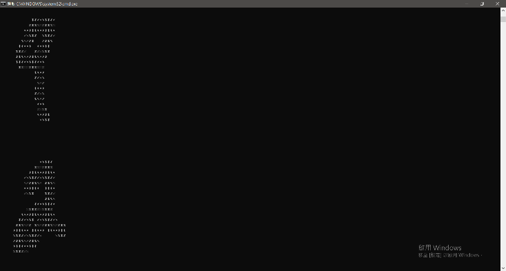
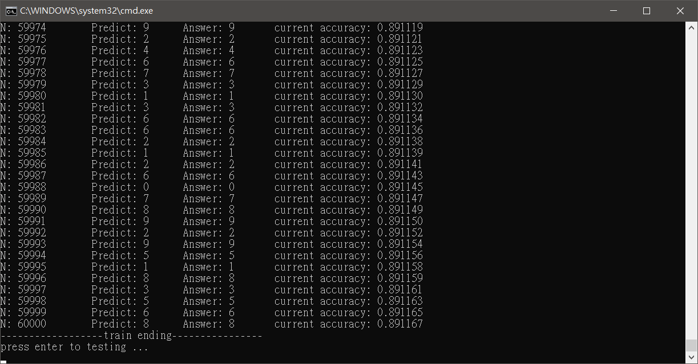
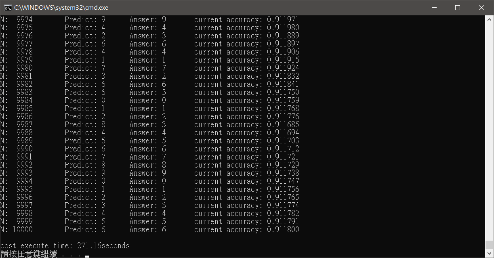

# MNIST-1Layer

#### MNIST

#### training log

#### testing log

 dataset        | N       | Accuarcy ( % )
:--------------:|:-------:|:----------:|
train data      | 60000   | 89.07
test data       | 10000   | 91.39

* IDE: VS 2015
